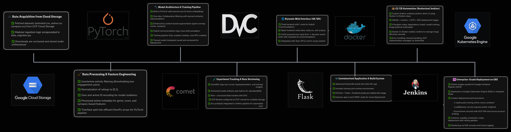

<h1 style='text-align:center;color:#46c2ac'> Anime Nexus </h1>


Anime Nexus is a sophisticated, production-grade recommendation system that seamlessly blends **collaborative filtering** and **content-based filtering** to deliver personalized anime suggestions. Designed with a robust MLOps pipeline, it ensures scalability, reproducibility, and seamless deployment. Whether you're an anime enthusiast or a platform looking to enhance user engagement, Anime Nexus is built to deliver.

[](https://ghcr.io/vdnt/anime-nexus:latest)


## Project Overview
Anime Nexus leverages user-anime interaction data (ratings) and anime metadata (genres, scores, etc.) to provide a hybrid recommendation system. It uses PyTorch based model to learn user and anime embeddings, Flask for the web app, and a CI/CD pipeline with Jenkins and Docker-in-Docker (DinD) for automated deployment on Google Kubernetes Engine (GKE). Data versioning with DVC, experiment tracking with Comet ML, and cloud integration with GCP make this a production-ready solution.

## Use Cases
- **For Anime Enthusiasts**: Discover new anime tailored to your watching history and preferences, whether you love action-packed shonen or heartfelt slice-of-life series.
- **For Streaming Platforms**: Boost user engagement by recommending relevant anime, improving retention rates and enhancing the viewing experience.
- **For Developers**: A blueprint for building scalable, hybrid recommendation systems with end-to-end MLOps practices, from data ingestion to deployment.

## Pipeline Overview
Below is a visual representation of the Anime Nexus pipeline:



## Directory Structure
Here’s the structure of the main project files :

```
.
├── application.py              # Flask app for serving recommendations
├── config/
│   ├── config.yaml             # Configuration file for paths and settings
│   ├── paths_config.py         # Path definitions for data and artifacts
│   └── __init__.py
├── custom_jenkins/
│   └── Dockerfile              # Dockerfile for Jenkins DinD setup
├── deployment.yaml             # Kubernetes deployment and service configuration
├── Dockerfile                  # Dockerfile for the application container
├── Jenkinsfile                 # Jenkins pipeline for CI/CD
├── pipelines/
│   ├── prediction_pipeline.py  # Hybrid recommendation logic
│   ├── training_pipeline.py    # Model training script
│   └── __init__.py
├── requirements.txt            # Project dependencies
├── setup.py                    # Package setup script
├── src/
│   ├── base_model.py           # Core recommendation model
│   ├── custom_exception.py     # Custom exception handling
│   ├── data_ingestion.py       # Data ingestion from GCP
│   ├── data_processing.py      # Data preprocessing and splitting
│   ├── logger.py               # Logging utility
│   ├── model_training.py       # Model training utilities
│   └── __init__.py
├── static/
│   ├── script.js               # Frontend JavaScript for dynamic rendering
│   └── style.css               # CSS for web app styling
├── templates/
│   └── index.html              # Web app homepage template
└── utils/
    ├── common_functions.py     # Utility functions
    ├── helpers.py              # Helper scripts
    ├── tester.py               # Testing utilities
    └── __init__.py
```

## Working Demo
See Anime Nexus in action! Check out the demo video below:

🎥 [Watch the Demo Video](assets/anime_nexus_demo_video.mp4)

## Workflow Stages

### ⚙️ Data Ingestion
- **Tool**: Google Cloud Platform (GCP) Buckets
- **Functionality**: Pulls raw data (`animelist.csv`, `anime.csv`, `synopsis.csv`) from a GCP bucket (`anime-rec-sys-data`) using the `data_ingestion.py` script. Limits large datasets (e.g., `animelist.csv`) to a specified number of rows for efficient processing, storing them in `artifacts/raw/`.

### 🛠️ Data Processing
- **Tool**: Pandas, NumPy
- **Functionality**: Processes user ratings and anime metadata using `data_processing.py`. Filters users with at least 5 reviews, normalizes ratings, encodes user/anime IDs, splits data into train/test sets, and processes metadata (genres, scores) for content-based filtering, saving processed files in `artifacts/processed/`.

### 🤖 Model Training
- **Tool**: PyTorch
- **Functionality**: Trains a hybrid model (`base_model.py`) using cosine similarity for collaborative filtering and metadata for content-based filtering. The `training_pipeline.py` script runs locally with GPU support, training embeddings for users and animes, and saves the model to `artifacts/model/`.

### 📊 Experiment Tracking
- **Tool**: Comet ML
- **Functionality**: Tracks training metrics (e.g., loss) and logs the trained model using Comet ML. Integrated into `training_pipeline.py`, it ensures experiments are reproducible and comparable, supporting iterative model improvements.

### 📂 Data Versioning
- **Tool**: DVC, GCP Bucket
- **Functionality**: Versions raw and processed data with DVC, using a second GCP bucket (`anime-rec-sys-dvc`) as remote storage. Ensures data consistency across environments, with `dvc pull` and `dvc push` integrated into the CI/CD pipeline.

### 🌐 Web Application
- **Tool**: Flask, JavaScript
- **Functionality**: A Flask app (`application.py`) serves recommendations via a user-friendly interface (`index.html`). Users input a `user_id`, and `script.js` dynamically renders anime cards with:
  - Background images and metadata fetched via **Jikan API**, **AniList API**, and **Kitsu API**.
  - Features like parallax effects, loading animations, and a progress bar for an engaging experience.

### 🚀 CI/CD with Docker DinD and Jenkins
- **Tool**: Docker, Jenkins
- **Functionality**: A Docker-in-Docker (DinD) setup (`jenkins-dind-v2`) automates the CI/CD pipeline using `Jenkinsfile`. It clones the repo, pulls data with DVC, builds the app image (`gcr.io/anime-rec-sys/anime-nexus:latest`), pushes it to Google Container Registry (GCR), and deploys to GKE.
- **Docker Image**:  
   [Anime Nexus on Docker Hub](docker-hub-placeholder-link)

### ☁️ Deployment on GKE
- **Tool**: Google Kubernetes Engine (GKE)
- **Functionality**: Deploys the app on a GKE cluster (`rec-sys-cluster`) in Autopilot mode using `deployment.yaml`. Runs a single pod (`anime-rec-sys`) with a LoadBalancer service, accessible at `34.16.69.107:80`, ensuring scalability and high availability.


## MLOps Highlights
- **Scalability**: GKE Autopilot ensures the app scales with demand, with LoadBalancer handling traffic efficiently.
- **Reproducibility**: DVC and Comet ML guarantee consistent data and experiments across development cycles.
- **Automation**: Jenkins and Docker DinD streamline CI/CD, minimizing manual effort and enabling rapid iteration.

## Getting Started
1. Clone the repository:  
   ```bash
   git clone https://github.com/VDNT11NULL/Anime-Nexus.git
   ```
2. Set up GCP credentials and configure `config.yaml` for bucket access.
3. Run the pipeline via Jenkins at `http://localhost:8082` or execute each stage manually.
4. Access the web app at `http://34.16.69.107`.

- `NOTE` : The web application may not be accessible via the external IP due to cloud billing constraints. You can deploy it on your own GKE cluster or use the provided Docker image for local or alternative hosting.